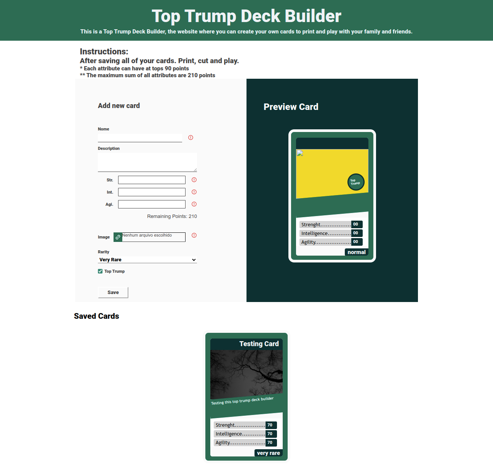
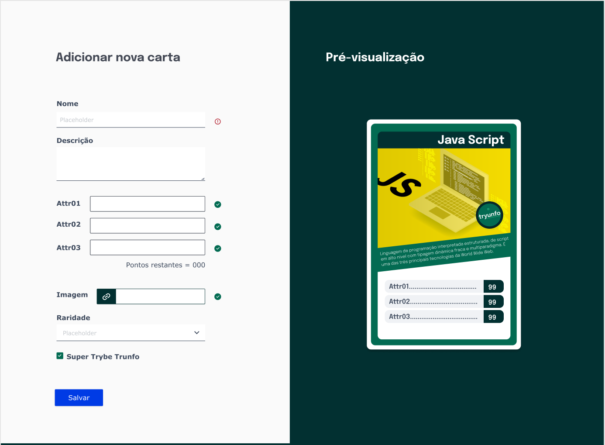
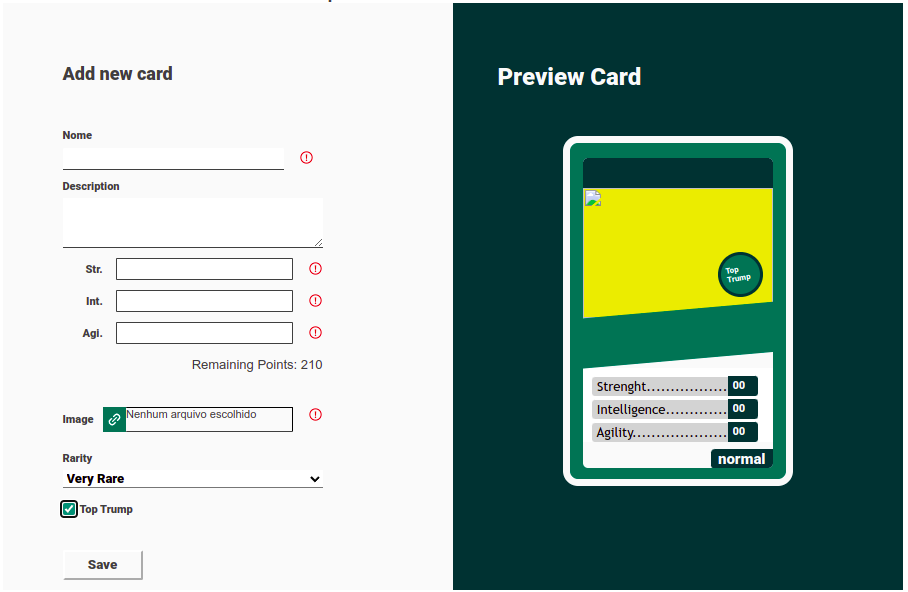

# Top Trump Deck Builder Project

  
<h2>:brazil: Português</h2>

  Esse projeto foi inspirado no primeiro projeto que fiz no módulo de Desenvolvimento Web FrontEnd no curso da Trybe, para fins educacionais.  O seu objetivo primário foi praticar transferência de informações por Props e praticar a estilização baseada em um modelo Figma. 
  Nesse projeto é possível se criar um baralho do tipo Top Trump personalizado, imprimir, recortar as cartas e jogar com os amigos.
  
  ## Objetivos
  * Usar Props para enviar informações entre componentes;
  * Seguir um modelo Figma (sem especificação exata de fontes, tamanhos e cores) para fazer a estilização;
  * Design responsivo;
  * Permitir ao usuário realizar o upload de imagens para a geração de cartas;
  * Realizar configuração e área de impressão;
  * Aplicar algumas validações nos campos de input.

  ## Live Link
  <a href="http://top-trump-deckbuilder.netlify.app" target="_blank">Criador de Decks SuperTrunfo</a>
  
  ## Screenshot
  
   
  Imagem do modelo Figma:                 |         ScreenShot da página
  :--------------------------------------:|:--------------------------------------:
       |  
  
  ## Tecnologias usadas
  * React
  * React Components 
  * HTML
  * CSS
  * Javacript
  
  ## Como usar
  Acesse o site, configure as suas cartas com: nome, descrição, atributos, imagens, raridade e trunfoo, salve-as imprima o site ( a área de impressão foi configurada para imprimir apenas as cartas), corte as cartas e jogue com os amigos. Instruções do jogo podem ser encontradas em: <a href="https://www.wikihow.com/Play-Top-Trumps" target="_blank">INSTRUÇÕES</a>
      
  ## Rodar Localmente
  ### Requisitos:
   * Node v16
   * Google Chrome
    
  ### Clonar no seu computador (via SSH)
  No terminal:
  
    git clone git@github.com:IgorMarinhoArgollo/top-trump.git
    npm install
  

  ### Iniciando o projeto localmente
  No diretório em que o repositório foi clonado, cole o seguinte comando no terminal para iniciar a aplicação localmente:
   
      npm start
   
  ## Informações de Desenvolvimento (Projeto Original)
  Commits de Desenvolvimento: 28;  
  Tempo Gasto: 3 dias;

##  

This project was inspired on the first project I did while studying the module of Front end Web Development in the Trybe course, for educational purposes.  The main goal was to practice information transfer through props and practice styling through a figma model.  In this project it is possible to create a personalized Top Trump deck, print, cut the cards and play with friends.

## My Goals
 * Use Props to send information between components;
 * Follow a figma model (without any indication of font of colors specification) to make the styling;
 * Responsive design;
 * Allow the user to upload images to make cards;
 * Configure printable area;
 * Apply some validations on inputs.

## Live Link
<a href="http://top-trump-deckbuilder.netlify.app" target="_blank">Top Trump Deck Builder</a>
  
## Screenshot

 
Figma Model Image:                      |           Page ScreenShot
:--------------------------------------:|:--------------------------------------:
     |  
  

## Used Technologies
  * React
  * React Components 
  * HTML
  * CSS
  * Javacript

## How to use it
  Go to the site, configure your cards with: name, description, attributes, images, rarity, top trump; save them, print the site (the printable area was cofigured to only print the saved cards), cut it from the paper and play with your friends. Instructions about how to play can be found in <a href="https://www.wikihow.com/Play-Top-Trumps" target="_blank">INSTRUCTIONS</a>
        
## Run Locally
  ### Requirements:
   * Node v16
   * Google Chrome
    
  ### Cloning into your computer (via SSH)
  On terminal:

      git clone git@github.com:IgorMarinhoArgollo/top-trump.git
      npm install

  ### Starting project locally
  On the directory that you have cloned the repository, paste the command on terminal to start the application:

      npm start

    
## Development Information (Original Project)
  Development Commits: 28;  
  Time Spent: 3 days;   
